# Traffic Accident Spatial Risk Modeling

Spatial Statistics, Road Network Analysis and Machine Learning for Road Collision Risk Assessment in London

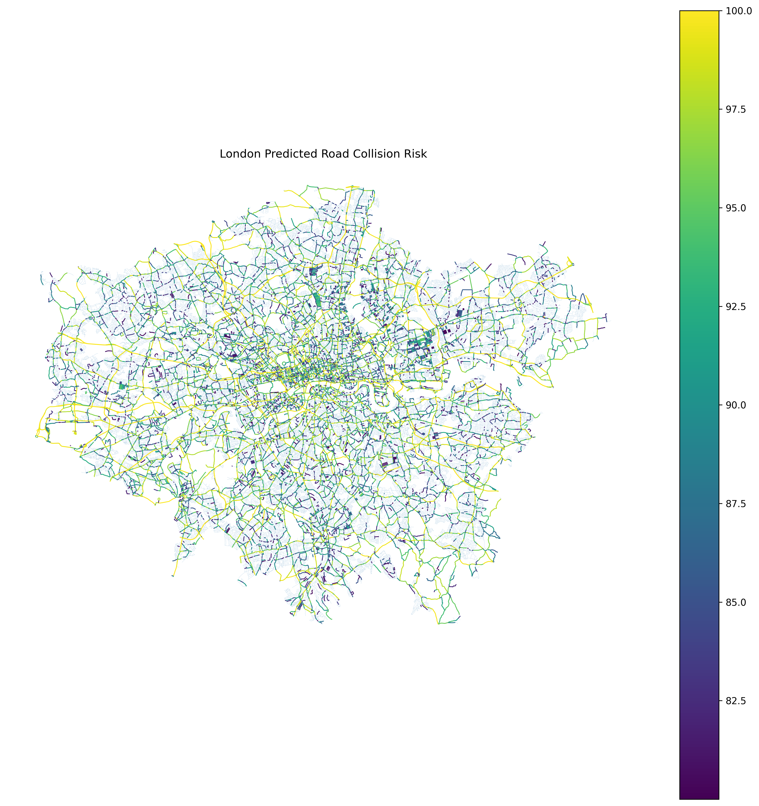

This project combines spatial statistics, GIS, road-network analysis and machine learning to identify and visualize high-risk road segments across London.

---

# [TR] Türkçe

## Proje Hakkında

Traffic Accident Spatial Risk Modeling, trafik kazalarının yalnızca geçmişte nerede gerçekleştiğini göstermek yerine, yol ağı özellikleri ve mekânsal örüntüler üzerinden riskli yol segmentlerini belirlemeyi amaçlayan uçtan uca bir mekânsal veri bilimi projesidir.

Projede 2025 yılı Birleşik Krallık trafik kazası verileri kullanılarak Londra özelinde kapsamlı bir analiz gerçekleştirilmiştir.

Çalışma kapsamında:

- Veri temizleme ve feature engineering
- GIS tabanlı mekânsal veri işleme
- OpenStreetMap yol ağı analizi
- Kaza noktalarının yol segmentleriyle eşleştirilmesi
- Mekânsal yoğunluk analizi
- Global Moran's I
- Local Moran's I (LISA)
- Getis-Ord Gi* hotspot analizi
- Network feature engineering
- Makine öğrenmesi ile yol risk modelleme
- Threshold optimizasyonu
- Yol bazlı risk skorlaması
- Mekânsal model doğrulaması
- İnteraktif risk haritası

uygulanmıştır.

Son aşamada analiz ve model sonuçları Streamlit ve Folium kullanılarak geliştirilen interaktif Londra yol risk haritası üzerinden sunulmuştur.

---

## Projenin Amacı

Geleneksel trafik kazası analizleri çoğunlukla geçmiş kazaların harita üzerinde gösterilmesine dayanır.

Bu projede ise temel araştırma sorusu şudur:

> Hangi yol segmentleri, yol ağı ve yapısal özellikleri nedeniyle daha yüksek kaza riski taşımaktadır?

Bu nedenle proje yalnızca geçmiş kazaları haritalamak yerine yol segmentlerini bağımsız analiz birimleri olarak ele almakta ve her segment için göreli bir risk skoru üretmektedir.

---

## Veri Seti

Kaynak veri 2025 yılı Birleşik Krallık trafik kazası kayıtlarından oluşmaktadır.

İlk veri seti:

```text
101,525 kaza kaydı
44 başlangıç değişkeni
```

Veri temizleme ve koordinat kontrollerinin ardından:

```text
101,523 mekânsal olarak geçerli kaza kaydı
73 değişken
```

elde edilmiştir.

Londra sınırları içerisinde:

```text
20,901 trafik kazası
3,856 ciddi veya ölümcül kaza
93 ölümcül kaza
```

analiz edilmiştir.

---

## Analiz Pipeline

```text
Raw Traffic Collision Data
        │
        ▼
Data Quality Analysis
        │
        ▼
Data Preparation & Feature Engineering
        │
        ▼
Spatial Data Preparation
        │
        ▼
London Road Network Extraction
        │
        ▼
Collision → Road Segment Matching
        │
        ▼
Accident Density Analysis
        │
        ├── Global Moran's I
        ├── Local Moran's I (LISA)
        └── Getis-Ord Gi*
        │
        ▼
Road Segment Risk Dataset
        │
        ▼
Network Feature Engineering
        │
        ▼
Machine Learning
        │
        ▼
Threshold Optimization
        │
        ▼
Road Risk Scoring
        │
        ▼
Spatial Model Validation
        │
        ▼
Interactive Road Risk Map
```

---

## 1. Veri Hazırlama

Ham trafik kazası verileri üzerinde veri kalite kontrolleri ve feature engineering uygulanmıştır.

Oluşturulan değişkenlerden bazıları:

- year
- month
- day_name
- is_weekend
- hour
- time_period
- is_rush_hour
- severity_label
- is_severe
- road_type_label
- urban_rural_label
- is_dark
- is_adverse_weather
- is_adverse_surface
- speed_band
- is_high_speed_road
- is_at_junction
- multiple_casualties
- multiple_vehicles

Son hazırlanan veri seti:

```text
101,523 gözlem
73 değişken
```

içermektedir.

---

## 2. Mekânsal Veri Hazırlama

Kazaların longitude ve latitude koordinatları kullanılarak GeoDataFrame oluşturulmuştur.

Başlangıç koordinat sistemi:

```text
EPSG:4326
```

Mesafe ve yol ağı analizlerinin metre cinsinden gerçekleştirilebilmesi için veriler British National Grid sistemine dönüştürülmüştür:

```text
EPSG:27700
```

Kaynak BNG koordinatları ile yeniden hesaplanan koordinatlar karşılaştırılarak dönüşüm doğrulanmıştır.

Ortalama mutlak koordinat farkları:

```text
Easting  : 0.17 m
Northing : 0.28 m
```

---

## 3. London Road Network Analysis

OpenStreetMap kullanılarak Londra'nın sürüş yol ağı çıkarılmıştır.

```text
130,863 node
304,481 road segment
```

Londra'daki 20,901 kaza en yakın OpenStreetMap yol segmentiyle eşleştirilmiştir.

```text
16,999 yol segmentinde en az bir kaza
```

Kaza-yol eşleştirme kalite kontrolü:

```text
19,080 → 10 m içerisinde
20,481 → 25 m içerisinde
20,743 → 50 m içerisinde
```

Kazaların %99.24'ü 50 metre eşiği içerisinde kalmıştır.

---

## 4. Accident Density Analysis

Londra üzerinde 250 × 250 metre çözünürlüğünde düzenli grid oluşturulmuştur.

İki farklı yoğunluk yüzeyi hesaplanmıştır:

1. Collision Density
2. Severity-Weighted Collision Density

Kaza şiddeti ağırlıkları:

```text
Slight  = 1
Serious = 3
Fatal   = 5
```

Yaklaşık 500 metrelik mekânsal smoothing uygulanmıştır.

### Collision Density

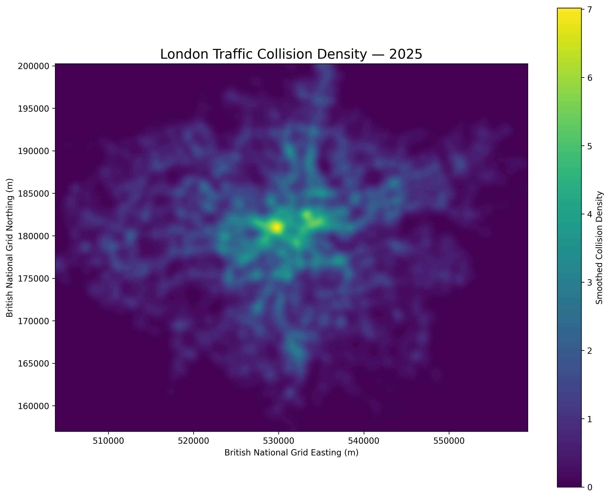

### Severity-Weighted Collision Density

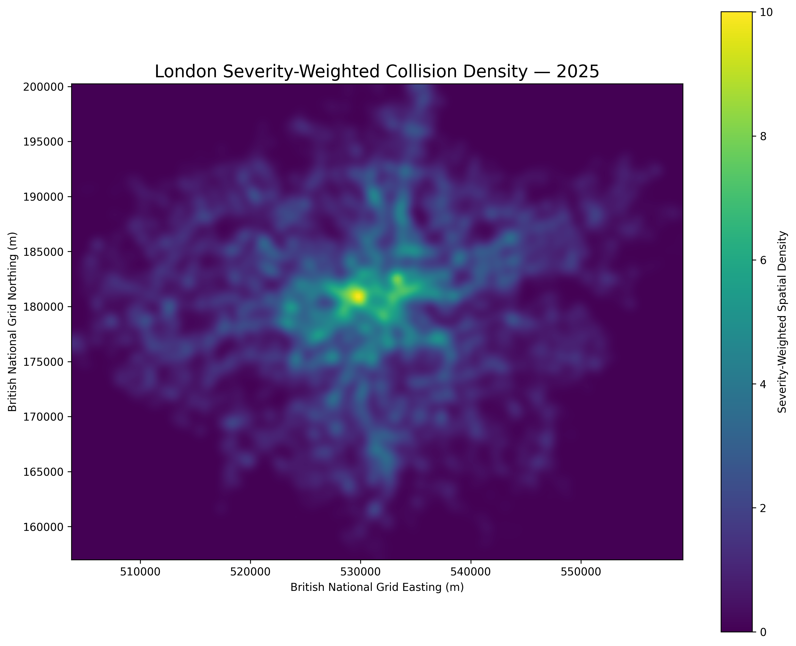

```text
Analizde kullanılan kazalar : 20,743
Grid cell size              : 250 m
Analiz grid hücreleri       : 27,560
High-density candidates     : 1,403
```

---

## 5. Global Moran's I

Kaza yoğunluğunun mekânsal olarak rastgele dağılıp dağılmadığını incelemek amacıyla Global Moran's I uygulanmıştır.

Queen contiguity tabanlı mekânsal ağırlık matrisi ve 999 permutation kullanılmıştır.

### Collision Density

```text
Moran's I = 0.984336
p-value   = 0.001
```

### Severity-Weighted Density

```text
Moran's I = 0.984607
p-value   = 0.001
```

Sonuçlar, trafik kazası yoğunluğunun Londra genelinde güçlü ve istatistiksel olarak anlamlı pozitif mekânsal otokorelasyon gösterdiğini ortaya koymaktadır.

---

## 6. Local Moran's I (LISA)

Local Moran's I analizi lokal kümelenmelerin ve mekânsal aykırı değerlerin belirlenmesi amacıyla uygulanmıştır.

Alanlar:

- High-High
- Low-Low
- High-Low
- Low-High
- Not Significant

kategorilerine ayrılmıştır.

### LISA Collision Density

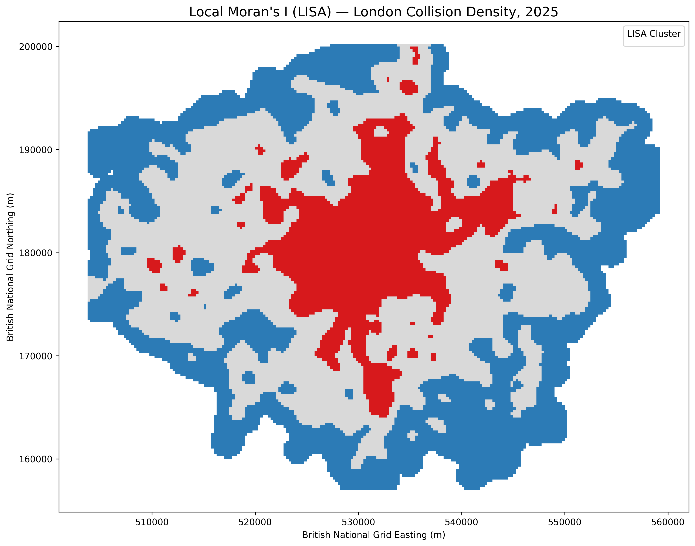

### LISA Severity Density


---

## 7. Getis-Ord Gi* Hotspot Analysis

Getis-Ord Gi* analizi kullanılarak istatistiksel olarak anlamlı sıcak ve soğuk noktalar belirlenmiştir.

### Collision Hotspots

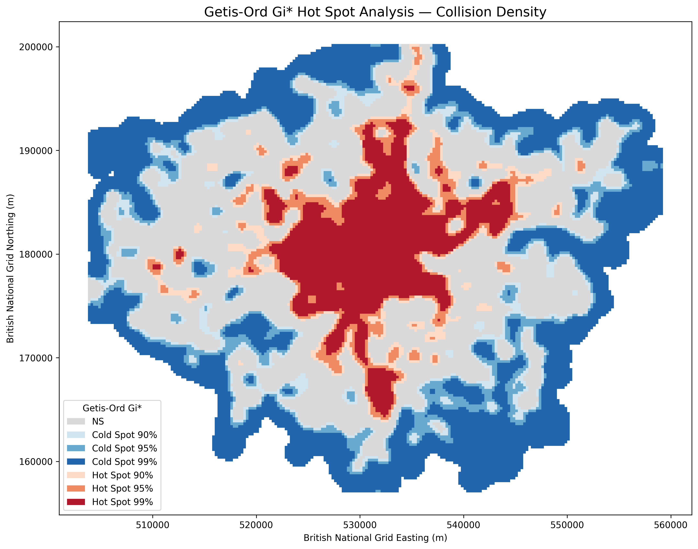

### Severity Hotspots

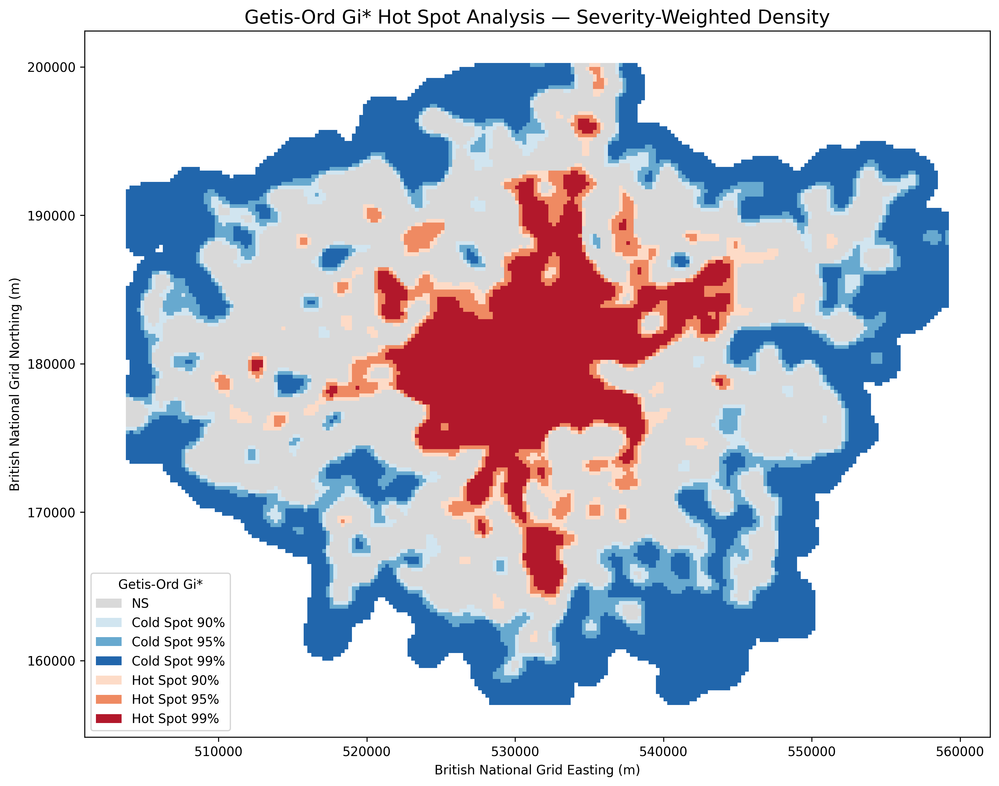

---

## 8. Road Segment Risk Dataset

Londra yol ağı road-segment seviyesinde modelleme veri setine dönüştürülmüştür.

```text
Total Road Segments : 304,481
```

Model hedef değişkeni:

```text
has_collision
```

Hedef dağılımı:

```text
No Collision  : 287,482
Collision     : 16,999
Positive Rate : 5.58%
```

Ayrıca:

```text
Severe Collision Segments : 3,673
Severe Collision Rate     : 1.21%
```

Bu dağılım nedeniyle problem belirgin bir class imbalance yapısına sahiptir.

---

## 9. Network Feature Engineering

Yol segmentlerinden ve ağ topolojisinden modelleme amacıyla çeşitli özellikler oluşturulmuştur.

Örnek değişkenler:

- segment_length_m
- log_segment_length
- road_hierarchy
- is_major_road
- has_road_name
- is_oneway
- is_bridge
- is_tunnel
- maxspeed_numeric
- maxspeed_missing
- high_speed_osm
- start_degree
- end_degree
- mean_node_degree
- max_node_degree
- degree_difference
- touches_intersection
- touches_complex_intersection
- touches_dead_end
- road_complexity_index

Yaklaşık:

```text
130,856 unique network node
```

üzerinden bağlantısallık özellikleri hesaplanmıştır.

---

## 10. Machine Learning

Road-segment collision risk modellemesi için:

- Logistic Regression
- Random Forest

modelleri eğitilmiştir.

```text
Total Records    : 304,481
Training Records : 243,584
Test Records     : 60,897
Positive Rate    : 5.58%
```

Model girdilerinde geçmiş kaza sayısından türetilmiş değişkenler kullanılmamış ve target leakage kontrolü gerçekleştirilmiştir.

### Model Sonuçları

| Model | Accuracy | Precision | Recall | F1 | ROC-AUC | PR-AUC |
|---|---:|---:|---:|---:|---:|---:|
| Logistic Regression | 0.7549 | 0.1480 | 0.7126 | 0.2451 | 0.8077 | 0.2383 |
| Random Forest | 0.8068 | 0.1683 | 0.6244 | 0.2652 | 0.8025 | 0.2264 |

Hedef değişkenin yalnızca %5.58'inin pozitif olması nedeniyle değerlendirmede accuracy tek başına kullanılmamıştır.

PR-AUC kriterine göre Logistic Regression ana model olarak seçilmiştir.

### ROC Curve

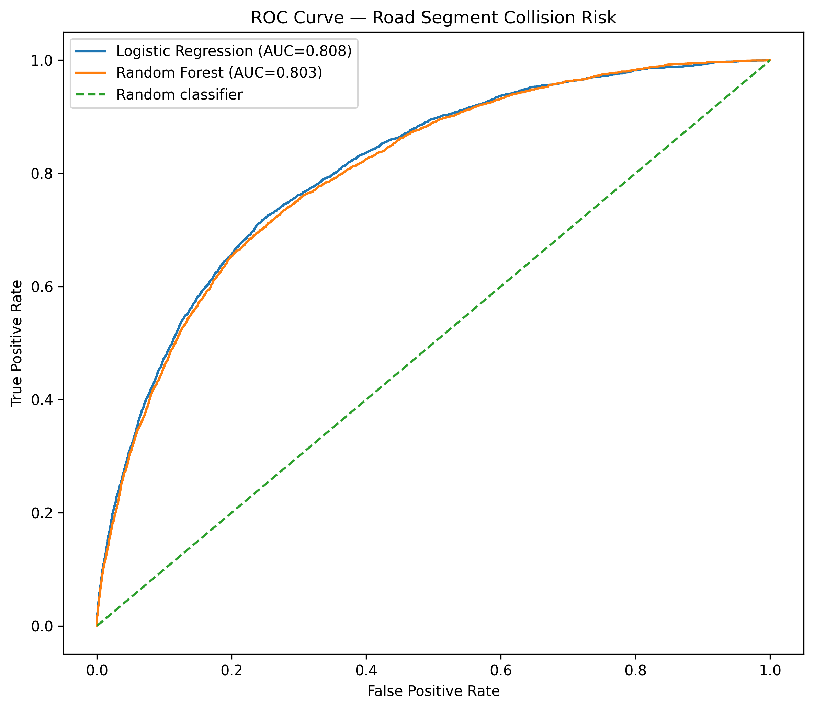

### Precision-Recall Curve

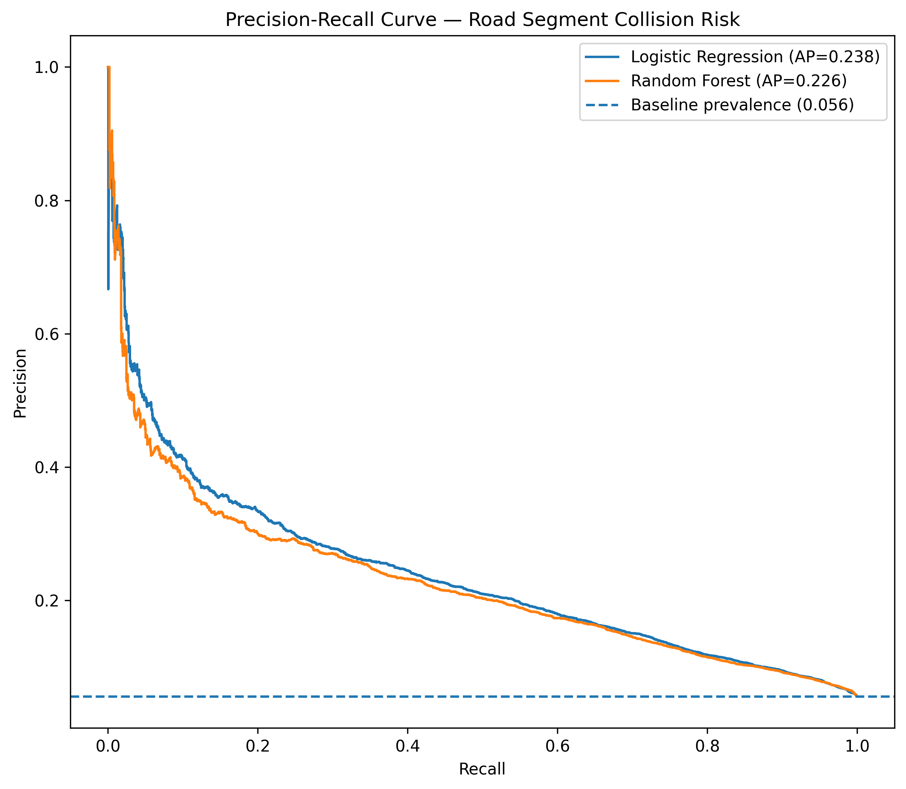

---

## 11. Threshold Optimization

0.10 ile 0.90 arasındaki farklı classification threshold değerleri değerlendirilmiştir.

Seçilen operating threshold:

```text
Threshold         : 0.75
Precision         : 0.2324
Recall            : 0.4244
F1 Score          : 0.3003
Specificity       : 0.9171
Balanced Accuracy : 0.6708
ROC-AUC           : 0.8077
PR-AUC            : 0.2383
```

### Threshold Performance

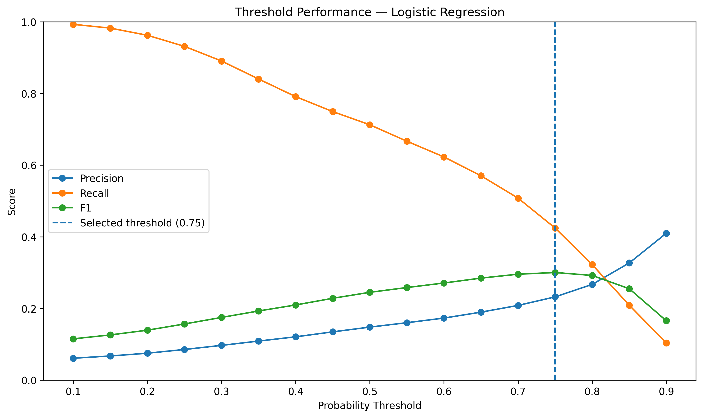

---

## 12. Model Interpretation & Road Risk Scoring

Logistic Regression katsayıları kullanılarak modelin yol riski üzerindeki etkileri incelenmiştir.

Öne çıkan değişkenler arasında:

- road hierarchy
- segment length
- highway type
- one-way status
- node degree

bulunmaktadır.

### Feature Importance

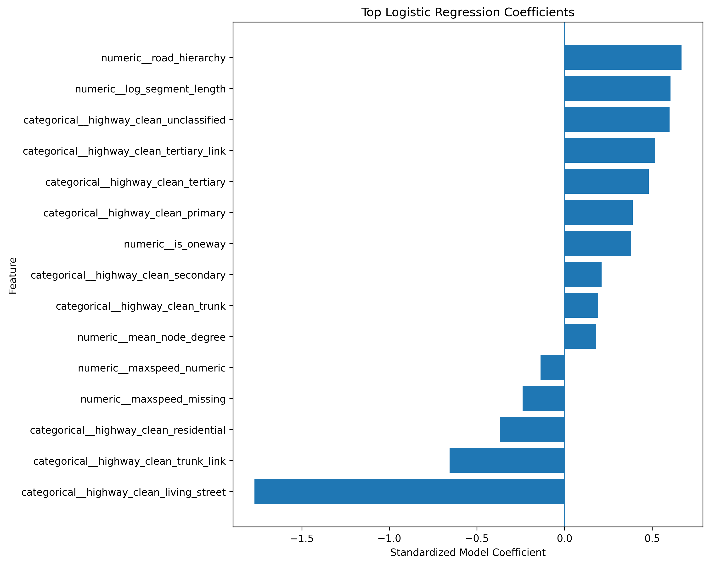

Model tahminleri daha sonra road-level risk skorlarına dönüştürülmüştür.

Her yol segmenti için:

- Model Risk Score
- Risk Percentile
- Risk Category

üretilmiştir.

```text
Critical → Top 5%
High     → 80th–95th percentile
Moderate → 50th–80th percentile
Low      → Bottom 50%
```

### Predicted Road Risk


Risk skoru gelecekte bir kazanın kesin gerçekleşme olasılığı olarak değil, yol segmentlerinin birbirlerine göre göreli risk göstergesi olarak yorumlanmalıdır.

---

## 13. Spatial Model Validation

Makine öğrenmesi modelinin risk skorları bağımsız mekânsal kaza yoğunluğu sonuçlarıyla karşılaştırılmıştır.

### Risk Score vs Collision Density

```text
Spearman rho = 0.1741
p-value < 0.001
```

### Risk Score vs Severity Density

```text
Spearman rho = 0.1751
p-value < 0.001
```

### High + Critical Roads

```text
Hotspot Capture Rate     : 30.77%
Collision Capture        : 67.73%
Severe Collision Capture : 68.21%
```

### Critical Roads

```text
Hotspot Capture Rate     : 10.35%
Collision Capture        : 31.88%
Severe Collision Capture : 32.65%
```

### Spatial Validation Map

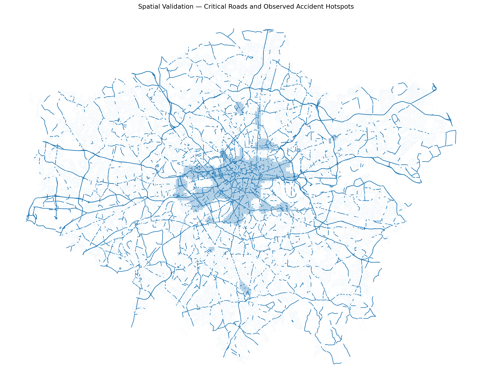

### Predicted Risk vs Observed Collision Density

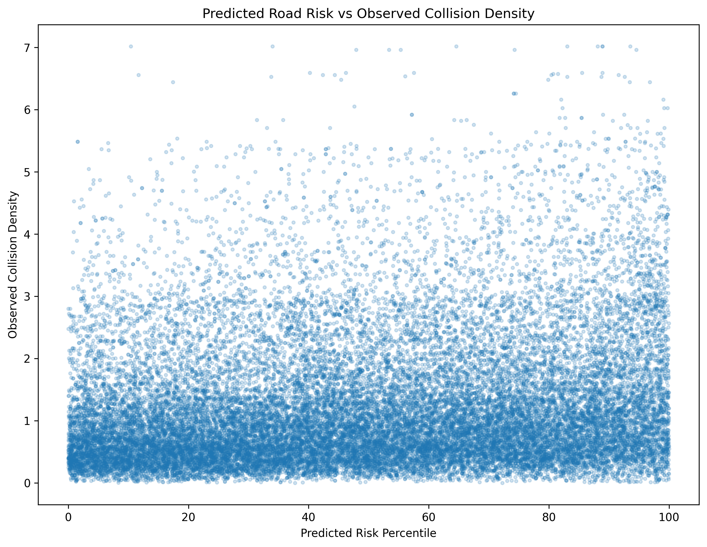

Bu sonuçlar modelin geçmiş kaza sayılarını doğrudan predictor olarak kullanmadan yol ağı ve yapısal özellikler üzerinden yüksek riskli segmentleri belirli ölçüde ayırt edebildiğini göstermektedir.

---

## 14. Interactive Road Risk Map

Analiz sonuçlarının interaktif olarak incelenebilmesi amacıyla Streamlit ve Folium kullanılarak bir web uygulaması geliştirilmiştir.

Uygulama üzerinden kullanıcılar:

- Risk Category
- Minimum Risk Percentile
- Road Type
- Observed Collision
- Severe Collision

filtrelerini kullanabilmektedir.

Harita üzerinde yol segmentleri risk kategorilerine göre görselleştirilmekte ve segment bazında:

- Road Type
- Risk Category
- Risk Percentile
- Model Risk Score
- Observed Collisions
- Severe Collisions
- Fatal Collisions

bilgileri incelenebilmektedir.

Harita performansını korumak amacıyla interaktif görselleştirme en yüksek riskli yol segmentlerinin sınırlı bir bölümünü render ederken, özet metrikler filtrelenmiş veri setinin tamamı üzerinden hesaplanmaktadır.

Web uygulaması projenin analitik katmanının yerine geçmemekte; mekânsal analiz ve makine öğrenmesi sonuçlarının interaktif sunum katmanı olarak kullanılmaktadır.

---

## Temel Bulgular

```text
Valid UK Collision Records       : 101,523
London Collisions                : 20,901
London Road Segments             : 304,481
Road Segments With Collisions    : 16,999

Collision Density Moran's I      : 0.984336
Severity Density Moran's I       : 0.984607

Best Model                       : Logistic Regression
ROC-AUC                          : 0.8077
PR-AUC                           : 0.2383

High/Critical Collision Capture  : 67.73%
High/Critical Severe Capture     : 68.21%
```

---

## Proje Yapısı

```text
Traffic_Accident_Spatial_Risk_Modeling/
│
├── app/
│   ├── app.py
│   └── run_app.py
│
├── data/
│   ├── raw/
│   └── processed/
│
├── models/
│
├── outputs/
│   ├── figures/
│   ├── maps/
│   ├── modeling/
│   └── validation/
│
├── src/
│   ├── 01_data_quality.py
│   ├── 02_data_preparation.py
│   ├── 03_spatial_preparation.py
│   ├── 04_road_network.py
│   ├── 05_accident_hotspots.py
│   ├── 06_global_morans_i.py
│   ├── 07_local_morans_lisa.py
│   ├── 08_getis_ord_gi_star.py
│   ├── 09_road_segment_risk_dataset.py
│   ├── 10_network_feature_engineering.py
│   ├── 11_road_risk_modeling.py
│   ├── 12_model_evaluation.py
│   ├── 13_road_risk_scoring.py
│   └── 14_spatial_model_validation.py
│
├── requirements.txt
├── .gitignore
└── README.md
```

---

## Kullanılan Teknolojiler

### Data Analysis & Machine Learning

- Python
- Pandas
- NumPy
- Scikit-learn

### GIS & Spatial Statistics

- GeoPandas
- Shapely
- PySAL
- ESDA
- libpysal
- SciPy

### Road Network

- OSMnx
- OpenStreetMap

### Visualization & Application

- Matplotlib
- Folium
- Streamlit
- Streamlit-Folium

---

# [ENG] English

## Project Overview

Traffic Accident Spatial Risk Modeling is an end-to-end spatial data science project designed to identify high-risk road segments by combining traffic collision records, GIS, spatial statistics, road-network characteristics and machine learning.

Using 2025 UK road collision data, the project performs a London-focused analysis covering:

- Data quality assessment
- Feature engineering
- GIS-based spatial processing
- OpenStreetMap road-network extraction
- Collision-to-road matching
- Spatial density analysis
- Global Moran's I
- Local Moran's I (LISA)
- Getis-Ord Gi* hotspot analysis
- Network feature engineering
- Machine-learning risk modeling
- Threshold optimization
- Road-level risk scoring
- Spatial model validation
- Interactive risk mapping

---

## Objective

Traditional traffic collision analyses often focus on visualizing where crashes have already occurred.

This project instead investigates:

> Which road segments exhibit higher collision risk based on their road-network and structural characteristics?

Road segments are treated as individual analytical units and assigned relative risk scores.

---

## Dataset

The original 2025 UK road collision dataset contained:

```text
101,525 collision records
44 original variables
```

Following data cleaning and coordinate validation:

```text
101,523 spatially valid collision records
73 prepared variables
```

The London study area contained:

```text
20,901 collisions
3,856 severe or fatal collisions
93 fatal collisions
```

---

## Spatial Data Preparation

Collision coordinates were converted into a GeoDataFrame.

```text
Original CRS  : EPSG:4326
Analysis CRS  : EPSG:27700
```

British National Grid was used to enable distance and road-network calculations in metres.

Coordinate transformation validation produced mean absolute differences of:

```text
Easting  : 0.17 m
Northing : 0.28 m
```

---

## London Road Network

The London drivable road network was extracted from OpenStreetMap.

```text
130,863 nodes
304,481 road segments
```

All 20,901 London collision records were matched to their nearest road segments.

```text
16,999 road segments with at least one collision
99.24% of collisions within 50 m of matched roads
```

---

## Spatial Density Analysis

A regular 250 × 250 metre grid was constructed across the study area.

Two spatial density surfaces were analyzed:

- Collision Density
- Severity-Weighted Collision Density

```text
Slight  = 1
Serious = 3
Fatal   = 5
```

### Collision Density


### Severity-Weighted Density


---

## Spatial Autocorrelation

### Global Moran's I

```text
Collision Density Moran's I = 0.984336
p-value                     = 0.001

Severity Density Moran's I  = 0.984607
p-value                     = 0.001
```

The results indicate strong and statistically significant positive spatial autocorrelation.

### Local Moran's I — LISA

Local Indicators of Spatial Association were used to identify:

- High-High
- Low-Low
- High-Low
- Low-High
- Not Significant

clusters and spatial outliers.


---

## Getis-Ord Gi* Hotspot Analysis

Getis-Ord Gi* statistics were used to identify statistically significant collision hotspots and coldspots.


---

## Road Network Feature Engineering

The final road-level dataset contained:

```text
304,481 road segments
```

Target:

```text
has_collision
```

Distribution:

```text
No Collision  : 287,482
Collision     : 16,999
Positive Rate : 5.58%
```

Network and structural predictors included:

- Segment length
- Road hierarchy
- Road type
- Major-road indicator
- One-way status
- Bridge/tunnel indicators
- Maximum speed
- Node degree
- Network connectivity
- Dead-end indicators
- Road complexity

---

## Machine Learning

Two classification models were evaluated:

- Logistic Regression
- Random Forest

```text
Training Records : 243,584
Test Records     : 60,897
Positive Rate    : 5.58%
```

Target-derived collision variables were excluded from predictors to avoid target leakage.

### Model Performance

| Model | Accuracy | Precision | Recall | F1 | ROC-AUC | PR-AUC |
|---|---:|---:|---:|---:|---:|---:|
| Logistic Regression | 0.7549 | 0.1480 | 0.7126 | 0.2451 | 0.8077 | 0.2383 |
| Random Forest | 0.8068 | 0.1683 | 0.6244 | 0.2652 | 0.8025 | 0.2264 |

Because only 5.58% of road segments belonged to the positive class, evaluation focused on PR-AUC, ROC-AUC, recall and precision-recall trade-offs rather than accuracy alone.

Logistic Regression was selected as the primary model based on PR-AUC.

### ROC Curve


### Precision-Recall Curve


---

## Threshold Optimization

Classification thresholds between 0.10 and 0.90 were evaluated.

```text
Selected Threshold : 0.75
Precision          : 0.2324
Recall             : 0.4244
F1 Score           : 0.3003
Specificity        : 0.9171
Balanced Accuracy  : 0.6708
ROC-AUC            : 0.8077
PR-AUC             : 0.2383
```


---

## Model Interpretation & Risk Scoring

Logistic Regression coefficients were analyzed to investigate the road characteristics contributing to predicted risk.


Each road segment received:

- Model Risk Score
- Risk Percentile
- Risk Category

```text
Critical → Top 5%
High     → 80th–95th percentile
Moderate → 50th–80th percentile
Low      → Bottom 50%
```

### Predicted Road Risk


The score represents relative road risk and should not be interpreted as the literal probability of a future collision.

---

## Spatial Model Validation

Predicted risk scores were compared with independently generated spatial collision-density surfaces.

```text
Risk vs Collision Density
Spearman rho = 0.1741
p-value < 0.001

Risk vs Severity Density
Spearman rho = 0.1751
p-value < 0.001
```

### High + Critical Risk Roads

```text
Hotspot Capture Rate     : 30.77%
Collision Capture        : 67.73%
Severe Collision Capture : 68.21%
```

### Critical Risk Roads

```text
Hotspot Capture Rate     : 10.35%
Collision Capture        : 31.88%
Severe Collision Capture : 32.65%
```


---

## Interactive Road Risk Map

A lightweight interactive application was developed using Streamlit and Folium.

Users can filter road segments by:

- Risk category
- Minimum risk percentile
- Road type
- Observed collision status
- Severe collision status

Interactive road information includes:

- Road Type
- Risk Category
- Risk Percentile
- Model Risk Score
- Observed Collisions
- Severe Collisions
- Fatal Collisions

For interactive performance, map rendering is limited to the highest-risk road segments matching the selected filters, while summary metrics use the complete filtered dataset.

The application serves as an interactive presentation layer for the underlying spatial-statistical and machine-learning analyses.

---

## Key Results

```text
Valid Collision Records          : 101,523
London Collisions                : 20,901
London Road Segments             : 304,481
Segments With Collisions         : 16,999

Collision Density Moran's I      : 0.984336
Severity Density Moran's I       : 0.984607

Best Model                       : Logistic Regression
ROC-AUC                          : 0.8077
PR-AUC                           : 0.2383

High/Critical Collision Capture  : 67.73%
High/Critical Severe Capture     : 68.21%
```

The analysis demonstrates strong spatial clustering of road collisions across London and shows that road-network characteristics can be used to distinguish road segments with different levels of relative collision risk.

---

## Technologies

```text
Python
Pandas
NumPy
Scikit-learn
GeoPandas
Shapely
OSMnx
OpenStreetMap
PySAL
ESDA
libpysal
SciPy
Matplotlib
Folium
Streamlit
Streamlit-Folium
```

---

## Repository Structure

```text
Traffic_Accident_Spatial_Risk_Modeling/
│
├── app/
├── data/
├── models/
├── outputs/
│   ├── figures/
│   ├── maps/
│   ├── modeling/
│   └── validation/
├── src/
├── requirements.txt
├── .gitignore
└── README.md
```

---

## Disclaimer

This project was developed for analytical, educational and portfolio purposes.

Road-risk scores represent relative statistical risk based on the available collision and road-network data. They should not be interpreted as real-time traffic-safety predictions or used as a substitute for official road-safety assessments.